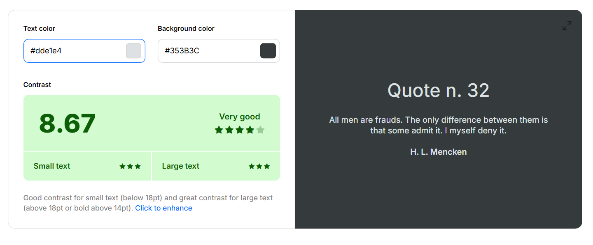
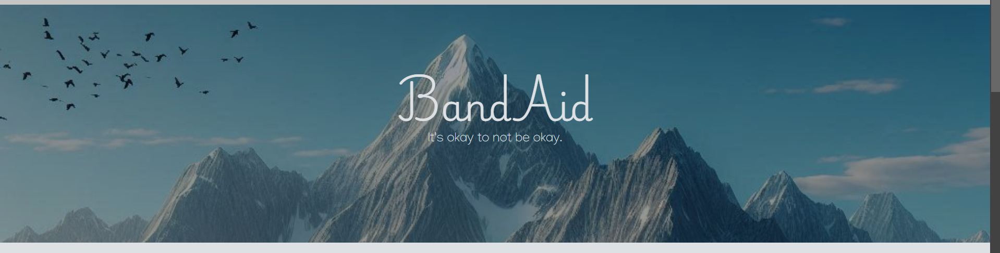

# **BandAid**
BandAid is an information webpage aimed at providing, supportive content such as affirmations and wellness tips, useful information pertaining to therapy types and external resources, emergency contacts for those within a crisis. The site is designed to be accessible to all, clear, reliable and responsive so the information provided can be found whenever on whatever device.

 

[insert finished website device mockup screenshot here]
---

## **Contents**

- [Basics](#Basic)
    - [Naming](#naming)
    - [User Stories](#user-stories)
- [User Design](#user-design)
    - [Wireframes](#wireframes)
    - [Colour Scheme](#Colour-scheme)
    - [Typography](#Typography)
    - [Imagery](#Imagery)
- [Page Features](#page-features)
    - [Nav Bar](#navbar)
    - [Hero Images](#hero-images)
        - [Home page Hero](#home-page-hero)
        - [Services page Hero](#services-page-hero)
    - [Main Content](#main-content)
        - [About](#about)
        - [Tips](#tips)
        - [Therapy](#therapy)
    - [Footer](#footer)
- [Responsivity](#responsivity)
    - [Mobile Layout](#mobile-layout)
    - [Tablet Layout](#tablet-layout)
- [Future Features](#future-features)
    - [Future Changes](#future-changes)
- [Testing](#)
    - [Lighthouse Scores](#) 
    - [HTML Validation](#)
    - [CSS Validation](#)
    - [Bugs & Fixes](#)
- [Credits](#)
--- 

## Basics
When creating the basic information for the site, I struggled a little with coming up with the name for the site and the user stories on my own. Because of this, I used Copilot to support me.

### Naming
First I provided Copilot with a generic prompt just to see what it came up with as I was only looking for insparation.

None of the suggested names inspired me and so I tried a slightly more in-depth prompt.

When I saw "Sereneaid" it inspired me to use BandAid due to the connotations of healing and support.
### User Stories 
Once again, I used Copilot to help be out with these too.
To begin with, I noted down my own idea of user needs:

And my own idea of User stories:

I knew these weren't the best and so I turned to Copilot to see what else it could come up with. These are the User needs:

And here are the user stories:

I then selected the ones I thought applied the best to the project and added these to my project board in github.

## User Design
Because I have a background in graphic design I decided to do as much of the design myself, choosing colour and typography using validators and checekrs to make sure they were acceptable and accessible as one of the user stories/needs of my site is to be as accessible as possible.

### Wireframes
I started by drawing out my wireframes by hand. I wanted to keep the design simple so that the site was easily accessible in a crisis.

#### Phone 
Because I was going to create this as mobile first, I made the mobile wireframe first:

#### Tablet

#### Laptop & PC 

### Colour Scheme
Because of the theme of the site I wanted to keep the site colours very soft but also contrasting and so I had a play around on Coolors. Once a randomsize pallet came up, I slight adjusted colours so they weren't too strong on the eye and ended up with this colour pallet:

Now I liked, I went to check their contrasts for accessiblitiy:

One of the user stories mentioned possibly having a light mode and a dark mdoe so I made sure to test it both ways so the same pallet could be used for both. While the other colours didn't have great contrast score, these 2 were the main colours I needed for the site and the others would only be for effects.

### Typography 
Using google fonts, I aimed to find a font I believed was looked tranquil. I liked the idea of a font that looked handwritten as this would make the site feel more personal to its users. As the primary (heading) font I landed on this:

Because the primary font was quiet fancy, I wanted to contrast this with a straight easily readable font for the information since the site is designed to be a source for info links. Exentually I decided on this as the seconday (content) font:

### Images

For the images on the site I used a mix of Copilot generated and images from google (for more precice imaging).

Both the hero images and the image in the "tips" section are generated by Copilot. Here are the prompts:

For the cards in the services section, I got one image from istock (the paper chain), 2 images from Canva (check box & art supplies) and the last photo of the puppy is my own (my goodest boy)

## Page Features

### NavBar
This is the same across both pages and stick to the top as you scroll for ease of access.

### Hero Images
Both pages have a hero section with an inspirational quote for those that use the site. However, each hero section has a different image background so the user knows they have changed page and title to reflect the page content.

#### Home page Hero
This Hero section reflects the home page being the landing area to the site and so includes the site name.

#### Services page Hero
This Hero section reflects the Therapies contained in th emain page content.

### Main Content
The main content of the site depends on which page you are on. For the home page there is the about section and the tips section, whereas in the services page there is a section of cards about different therapies.

#### About
This is the about section on the home page, giving a quick summary of the idea behind the site.

#### Tips
This is the tips section of the home page with a few tips to help mental health.

#### Therapy
This is the therapy section of the services page, aimed to give a quick summary of a few types of therapies.

### Footer
This is the footer section of the site, designed to be very simple and easy to read as it provides emergency numbers to contact in a mental health crisis. Because of this, it is the same across all sites

## Responsivity 
To make sure that the site was responsive across all devices I built it mobile first as this is most likely where people in a crisis will access the site.

### Mobile Layout

### Tablet Layout

## Future Features
While building there were a few features I couldn't add in due to knowledge constraints sure as the dark and light mode switch and the support channels. I would like to add these in the future as I think at least the style change is key to accessibility.
I'd also like to add the mood tracker and/or the ability to create an account to store information.

### Future Changes
There are a few things I'd like to change about the site including:
- Making the Hero image smaller in height so it doesnt take up so much room on the mobile layout.
- Center the Hero images on mobile devices.

## Testing

### LightHouse

## Credits

https://media.istockphoto.com/id/845547386/photo/human-chain-paper.jpg?s=612x612&w=0&k=20&c=mrcUyTiQdg6PXnHid-yjILRP1aIzkJXNHG2867YLoJg=